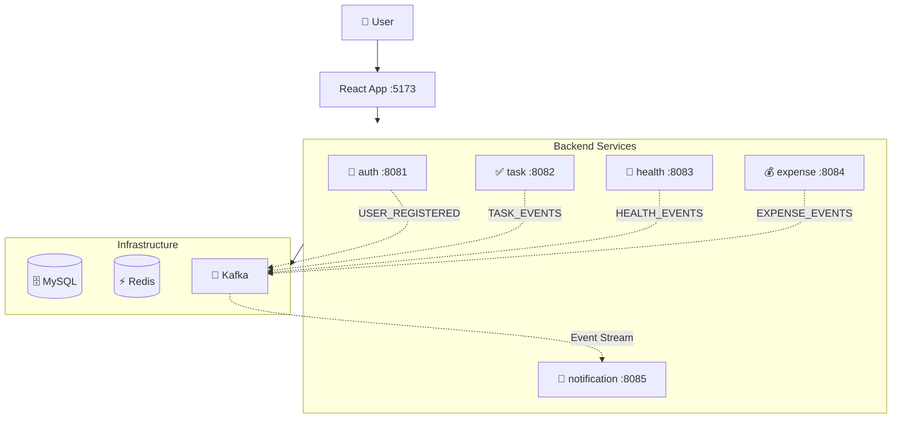

# Daily Life Tracker

> A comprehensive microservices-based personal tracker to manage your daily tasks, health, exercises, and expenses — all in one place.


## 📖 Overview

Daily Life Tracker is a full-stack application built with microservices architecture that helps you track and manage various aspects of your daily life. The system uses event-driven architecture with Kafka for real-time notifications and insights.

### 🎯 Key Features

- **🔐 Authentication & Security**
  - JWT-based authentication with refresh tokens
  - Multi-tab sync (login/logout syncs across browser tabs)
  - OTP-based password reset via email
  - Role-based access control (User/Admin)

- **✅ Task Management**
  - Create, update, and organize tasks
  - Filter by status, priority, and due date
  - Mark tasks as complete or reopen them
  - Track completion streaks

- **💪 Health & Exercise Tracking**
  - Daily health logs (mood, sleep hours, notes)
  - Custom health metrics
  - Exercise plan builder
  - Workout logging with today's workout view
  - Weekly health summaries

- **💰 Expense Management**
  - Track expenses by category
  - Set monthly budgets per category
  - Budget alerts (80% and 100% thresholds)
  - CSV bulk import for expenses
  - Monthly spend summaries with charts

- **🔔 Smart Notifications**
  - Real-time in-app notifications
  - Email alerts for important events
  - Daily insights and activity streaks
  - Event-driven notification system

- **👨‍💼 Admin Dashboard**
  - User management and statistics
  - Platform-wide analytics
  - Task, health, and expense insights across all users

## 🏗️ Architecture

The application follows a microservices architecture with event-driven communication:



### Event-Driven Flow
- Services publish events to Kafka topics when significant actions occur
- Notification service consumes these events and sends notifications/emails
- Redis caches OTPs, rate limits, and monthly expense summaries
- Each service has its own MySQL database (database-per-service pattern)

## 🛠️ Tech Stack

| Layer | Technologies |
|-------|--------------|
| **Frontend** | React 19, Vite 8, Redux Toolkit, React Router 7, Tailwind CSS 4, Recharts, Axios |
| **Backend** | Java 21, Spring Boot 3.5, Spring Security, Spring Data JPA |
| **Messaging** | Apache Kafka (event streaming) |
| **Caching** | Redis 7+ (OTP storage, rate limiting, caching) |
| **Database** | MySQL 8+ (separate databases per service) |
| **Email** | Spring Mail (SMTP) |
| **Build Tools** | Maven, npm |

## 🧩 Services

| Service | Port | Responsibility |
|---------|------|----------------|
| [auth-service](auth-service/) | 8081 | User authentication, JWT tokens, profile management, admin operations |
| [task-service](backend/task-service/) | 8082 | Task CRUD, filtering, completion tracking, streak calculations |
| [health-service](backend/health-service/) | 8083 | Health logs, custom metrics, exercise plans, workout logging |
| [expense-service](backend/expense-service/) | 8084 | Expense tracking, budgets, CSV import, monthly summaries |
| [notification-service](backend/notification-service/) | 8085 | Event consumption, in-app notifications, email alerts, insights |
| [tracker-app](frontend/tracker-app/) | 5173 | React SPA, Redux state management, responsive UI |

> 💡 Each service has its own README with detailed API documentation and configuration.

## 📁 Project Structure

```
daily-life-tracker/
├── auth-service/              # Authentication & user management
├── backend/
│   ├── task-service/          # Task management
│   ├── health-service/        # Health & exercise tracking
│   ├── expense-service/       # Expense & budget management
│   └── notification-service/  # Notifications & insights
├── frontend/
│   └── tracker-app/           # React frontend application
└── docs/                      # Documentation
    ├── SETUP.md              # Detailed setup guide
    ├── API.md                # Complete API documentation
    ├── KAFKA-EVENTS.md       # Event flows and topics
    ├── DATABASE-SCHEMA.md    # Database schemas
    └── TROUBLESHOOTING.md    # Common issues and solutions
```

## ⚙️ Prerequisites

Before you begin, ensure you have the following installed:

- **Java 21** (OpenJDK or Eclipse Temurin)
- **Maven 3.8+**
- **Node.js 18+** and **npm 9+**
- **MySQL 8.0+**
- **Redis 7.0+**
- **Apache Kafka 3.0+**

> 📘 For detailed installation instructions, see [docs/SETUP.md](docs/SETUP.md)

## 🚀 Quick Start

### 1️⃣ Setup Databases

```bash
# Login to MySQL
mysql -u root -p

# Create databases for each service
CREATE DATABASE tracker_auth;
CREATE DATABASE tracker_tasks;
CREATE DATABASE tracker_health;
CREATE DATABASE tracker_expenses;
CREATE DATABASE tracker_notifications;

# Create user and grant permissions (optional)
CREATE USER 'tracker_user'@'localhost' IDENTIFIED BY 'your_password';
GRANT ALL PRIVILEGES ON tracker_*.* TO 'tracker_user'@'localhost';
FLUSH PRIVILEGES;
```

### 2️⃣ Start Infrastructure Services

```bash
# Start Redis
redis-server

# Start Kafka (in separate terminal)
# For Windows:
bin\windows\zookeeper-server-start.bat config\zookeeper.properties
bin\windows\kafka-server-start.bat config\server.properties

# For Mac/Linux:
bin/zookeeper-server-start.sh config/zookeeper.properties
bin/kafka-server-start.sh config/server.properties
```

### 3️⃣ Configure Services

Each service requires environment variables. Copy and configure `.env` or set them in your IDE:

**Auth Service (8081):**
```properties
DB_URL=jdbc:mysql://localhost:3306/tracker_auth
DB_USERNAME=tracker_user
DB_PASSWORD=your_password
JWT_SECRET=your_secret_key_min_256_bits
REDIS_HOST=localhost
REDIS_PORT=6379
KAFKA_BOOTSTRAP_SERVERS=localhost:9092
SENDER_MAIL=your_email@gmail.com
MAIL_PASSWORD=your_app_password
```

**Other Services:** Similar configuration (see each service's README)

> 📘 For complete configuration guide, see [docs/SETUP.md](docs/SETUP.md)

### 4️⃣ Run Backend Services

Open separate terminals for each service:

```bash
# Terminal 1 - Auth Service
cd auth-service
mvn spring-boot:run

# Terminal 2 - Task Service
cd backend/task-service
mvn spring-boot:run

# Terminal 3 - Health Service
cd backend/health-service
mvn spring-boot:run

# Terminal 4 - Expense Service
cd backend/expense-service
mvn spring-boot:run

# Terminal 5 - Notification Service
cd backend/notification-service
mvn spring-boot:run
```

### 5️⃣ Run Frontend

```bash
cd frontend/tracker-app

# Create environment file
cp .env.example .env

# Install dependencies
npm install

# Start development server
npm run dev
```

### 6️⃣ Access the Application

Open your browser and navigate to:
- **Frontend:** http://localhost:5173
- **API Services:** http://localhost:8081-8085

**First Time Setup:**
1. Register a new account
2. Check your email for welcome message (if SMTP is configured)
3. Login and start using the tracker!

> 📌 **Tip:** Use separate terminal windows/tabs for each service to easily monitor logs.

## 📚 Documentation

| Document | Description |
|----------|-------------|
| [📘 Setup Guide](docs/SETUP.md) | Complete installation and configuration guide |
| [🔌 API Documentation](docs/API.md) | All API endpoints with examples |
| [🏗️ Architecture](docs/ARCHITECTURE.md) | System design and architecture decisions |
| [📨 Kafka Events](docs/KAFKA-EVENTS.md) | Event flows and message schemas |
| [🗄️ Database Schema](docs/DATABASE-SCHEMA.md) | Database structure for all services |
| [🔧 Troubleshooting](docs/TROUBLESHOOTING.md) | Common issues and solutions |

### Service-Specific READMEs

- [auth-service/README.md](auth-service/README.md) - Authentication APIs
- [backend/task-service/README.md](backend/task-service/README.md) - Task APIs
- [backend/health-service/README.md](backend/health-service/README.md) - Health & Exercise APIs
- [backend/expense-service/README.md](backend/expense-service/README.md) - Expense & Budget APIs
- [backend/notification-service/README.md](backend/notification-service/README.md) - Notification APIs
- [frontend/tracker-app/README.md](frontend/tracker-app/README.md) - Frontend setup

## 🤝 Contributing

This is a personal project for learning and portfolio purposes. Feedback and suggestions are welcome!

## 📄 License

This project is open source and available for educational purposes.

---

<div align="center">

**Built with ❤️ using Spring Boot & React**

[Report Bug](../../issues) · [Request Feature](../../issues)

</div>
