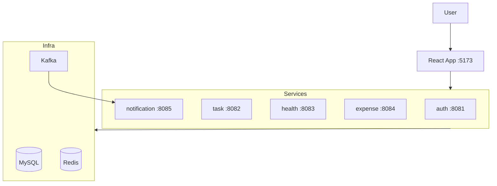

# Daily Life Tracker

A microservices-based personal tracker for tasks, health, exercise, expenses, and notifications. React frontend with Spring Boot services, secured by JWT.

## Features

- User auth (register, login, OTP password reset)
- Task management
- Health logs and exercise plans
- Expense tracking, budgets, and CSV import
- In-app notifications and email alerts
- Admin dashboard for users and platform stats

## Architecture



## Tech Stack

| Layer | Technologies |
|-------|--------------|
| Frontend | React, Vite, Redux Toolkit, Tailwind CSS |
| Backend | Java 21, Spring Boot 3.5 |
| Data | MySQL, Redis, Kafka |

## Services

| Service | Port | Responsibility |
|---------|------|----------------|
| [auth-service](auth-service/) | 8081 | Authentication, users, JWT |
| [task-service](backend/task-service/) | 8082 | Tasks |
| [health-service](backend/health-service/) | 8083 | Health logs, exercise plans |
| [expense-service](backend/expense-service/) | 8084 | Expenses, budgets, CSV import |
| [notification-service](backend/notification-service/) | 8085 | Notifications, email, insights |
| [tracker-app](frontend/tracker-app/) | 5173 | React UI |

## Project Structure

```
daily-life-tracker/
├── auth-service/
├── backend/
│   ├── task-service/
│   ├── health-service/
│   ├── expense-service/
│   └── notification-service/
└── frontend/tracker-app/
```

## Prerequisites

- Java 21, Maven
- Node.js 18+
- MySQL
- Redis
- Kafka

## Quick Start

1. Start MySQL, Redis, and Kafka locally.
2. Set environment variables for each service (`DB_URL`, `DB_USERNAME`, `DB_PASSWORD`, `JWT_SECRET`, `KAFKA_BOOTSTRAP_SERVERS`, `REDIS_HOST`, etc.). See each service README for details.
3. Run backend services (default ports 8081–8085):

```bash
cd auth-service && mvn spring-boot:run
cd backend/task-service && mvn spring-boot:run
# ... repeat for other services
```

4. Run the frontend:

```bash
cd frontend/tracker-app
cp .env.example .env
npm install && npm run dev
```

App runs at `http://localhost:5173`.

## Documentation

Per-service READMEs cover APIs, config, and service-specific flows:

- `auth-service/README.md`
- `backend/task-service/README.md`
- `backend/health-service/README.md`
- `backend/expense-service/README.md`
- `backend/notification-service/README.md`
- `frontend/tracker-app/README.md`
