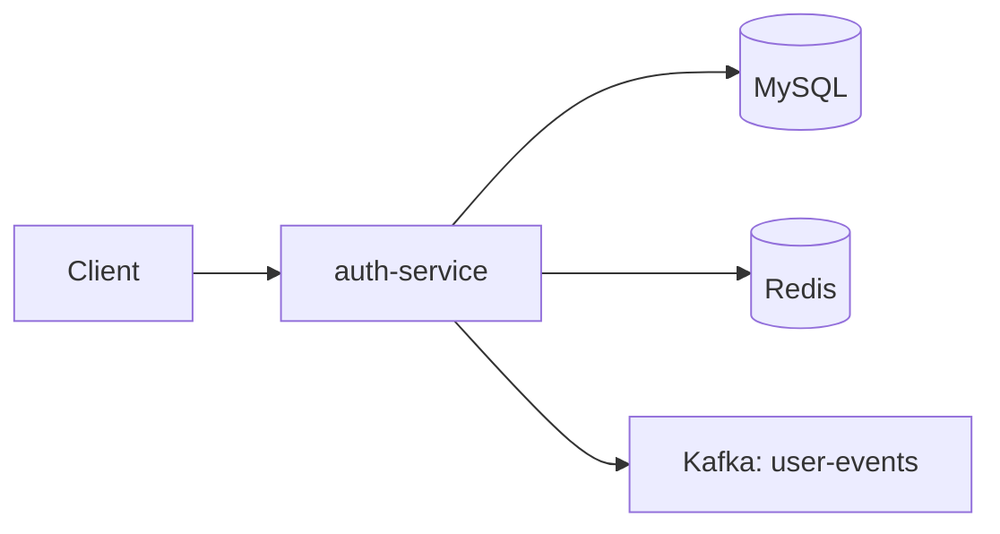

# Auth Service

> **[← Back to Main Project](../README.md)** | **[API Docs](../docs/API.md#auth-service-apis-8081)** | **[Architecture](../docs/ARCHITECTURE.md)**

Handles user registration, login, JWT tokens, profile management, and admin user operations.

**Port:** 8081

## Architecture



## Responsibilities

- Register, login, refresh, logout
- Forgot password flow (OTP via email)
- User profile and password management
- Admin user management and stats
- Publishes `USER_REGISTERED` events on signup

## API

| Method | Endpoint | Description |
|--------|----------|-------------|
| POST | `/api/auth/register` | Register user |
| POST | `/api/auth/login` | Login |
| POST | `/api/auth/refresh` | Refresh access token |
| POST | `/api/auth/logout` | Logout |
| POST | `/api/auth/forgot-password` | Send OTP |
| POST | `/api/auth/verify-otp` | Verify OTP |
| POST | `/api/auth/reset-password` | Reset password |
| GET | `/api/users/me` | Get profile |
| PUT | `/api/users/me` | Update profile |
| PUT | `/api/users/me/password` | Change password |
| DELETE | `/api/users/me` | Delete account |
| GET | `/api/users/admin/all` | List users (admin) |
| GET | `/api/users/admin/stats` | User stats (admin) |

## Environment Variables

| Variable | Purpose |
|----------|---------|
| `DB_URL`, `DB_USERNAME`, `DB_PASSWORD` | MySQL |
| `JWT_SECRET` | Token signing |
| `REDIS_HOST`, `REDIS_PORT` | OTP storage |
| `KAFKA_BOOTSTRAP_SERVERS` | Event publishing |
| `SENDER_MAIL`, `MAIL_PASSWORD` | OTP emails |

## Database

Creates tables automatically in `tracker_auth`:
- `users` - User accounts and credentials

**Full Schema**: [docs/DATABASE-SCHEMA.md](../docs/DATABASE-SCHEMA.md#auth-service-database-tracker_auth)

## Run

```bash
# From auth-service directory
mvn spring-boot:run

# Or with custom port
mvn spring-boot:run -Dspring-boot.run.arguments=--server.port=9081
```

## Testing

```bash
# Run tests
mvn test

# Build JAR
mvn clean package
```

## Troubleshooting

**Service won't start?**
- Ensure MySQL is running and `tracker_auth` database exists
- Verify Redis is running: `redis-cli ping`
- Check environment variables are set

**More help**: [docs/TROUBLESHOOTING.md](../docs/TROUBLESHOOTING.md)

## Documentation

- [Complete API Reference](../docs/API.md#auth-service-apis-8081)
- [Setup Guide](../docs/SETUP.md)
- [Kafka Events Published](../docs/KAFKA-EVENTS.md#user-events)
