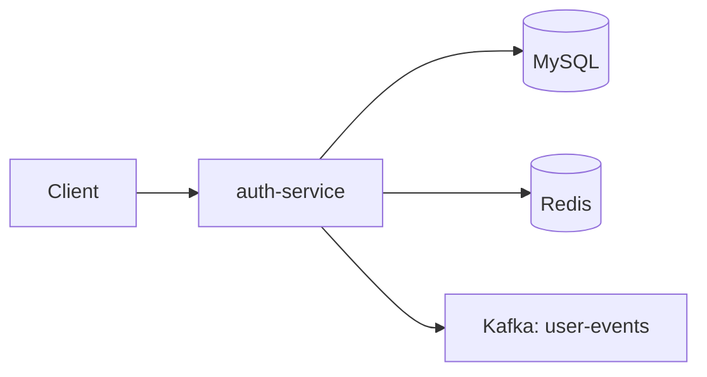

# Auth Service

Handles user registration, login, JWT tokens, profile management, and admin user operations.

**Port:** 8081

## Architecture



## Responsibilities

- Register, login, refresh, logout
- Forgot password flow (OTP via email)
- User profile and password management
- Admin user management and stats
- Publishes `USER_REGISTERED` events on signup

## API

| Method | Endpoint | Description |
|--------|----------|-------------|
| POST | `/api/auth/register` | Register user |
| POST | `/api/auth/login` | Login |
| POST | `/api/auth/refresh` | Refresh access token |
| POST | `/api/auth/logout` | Logout |
| POST | `/api/auth/forgot-password` | Send OTP |
| POST | `/api/auth/verify-otp` | Verify OTP |
| POST | `/api/auth/reset-password` | Reset password |
| GET | `/api/users/me` | Get profile |
| PUT | `/api/users/me` | Update profile |
| PUT | `/api/users/me/password` | Change password |
| DELETE | `/api/users/me` | Delete account |
| GET | `/api/users/admin/all` | List users (admin) |
| GET | `/api/users/admin/stats` | User stats (admin) |

## Environment Variables

| Variable | Purpose |
|----------|---------|
| `DB_URL`, `DB_USERNAME`, `DB_PASSWORD` | MySQL |
| `JWT_SECRET` | Token signing |
| `REDIS_HOST`, `REDIS_PORT` | OTP storage |
| `KAFKA_BOOTSTRAP_SERVERS` | Event publishing |
| `SENDER_MAIL`, `MAIL_PASSWORD` | OTP emails |

## Run

```bash
mvn spring-boot:run
```
