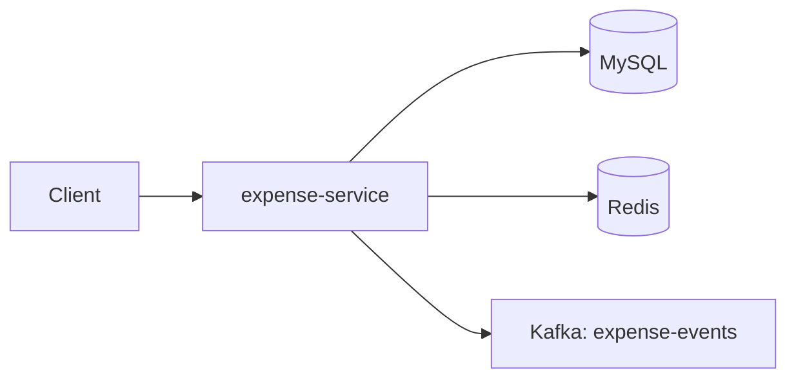

# Expense Service

> **[← Back to Main Project](../../README.md)** | **[API Docs](../../docs/API.md#expense-service-apis-8084)** | **[Architecture](../../docs/ARCHITECTURE.md)**

Manages expenses, monthly budgets, CSV import, and spend summaries.

**Port:** 8084

## Architecture



## Responsibilities

- CRUD for expenses
- Monthly budgets per category
- Budget status and threshold alerts (80% / 100%)
- CSV bulk import
- Monthly spend summary (Redis-cached)
- Publishes events on expense add and budget exceeded

## API

| Method | Endpoint | Description |
|--------|----------|-------------|
| POST | `/api/expenses` | Create expense |
| GET | `/api/expenses` | List expenses |
| GET | `/api/expenses/{id}` | Get expense |
| PUT | `/api/expenses/{id}` | Update expense |
| DELETE | `/api/expenses/{id}` | Delete expense |
| POST | `/api/expenses/import` | Import CSV |
| GET | `/api/expenses/summary/monthly` | Monthly summary |
| POST | `/api/budgets` | Create budget |
| GET | `/api/budgets` | List budgets |
| GET | `/api/budgets/status` | Budget vs spend |
| PUT | `/api/budgets/{id}` | Update budget |
| DELETE | `/api/budgets/{id}` | Delete budget |

Admin routes under `/api/expenses/admin`.

## Environment Variables

| Variable | Purpose |
|----------|---------|
| `DB_URL`, `DB_USERNAME`, `DB_PASSWORD` | MySQL |
| `JWT_SECRET` | Auth validation |
| `REDIS_HOST`, `REDIS_PORT` | Monthly spend cache |
| `KAFKA_BOOTSTRAP_SERVERS` | Event publishing |
| `EXPENSE_EVENTS_TOPIC` | Kafka topic (default: `expense-events`) |

## Database

Creates tables automatically in `tracker_expenses`:
- `expenses` - User expenses
- `budgets` - Monthly budgets by category

**Full Schema**: [docs/DATABASE-SCHEMA.md](../../docs/DATABASE-SCHEMA.md#expense-service-database-tracker_expenses)

## CSV Import Format

```csv
date,amount,category,description
2026-09-01,30.00,FOOD,Grocery shopping
2026-09-02,15.00,TRANSPORT,Uber ride
```

**Categories**: FOOD, TRANSPORT, ENTERTAINMENT, UTILITIES, HEALTHCARE, SHOPPING, OTHER

## Run

```bash
# From backend/expense-service directory
mvn spring-boot:run
```

## Troubleshooting

**Common issues:**
- Database not found: Create `tracker_expenses` database
- CSV import fails: Check date format (YYYY-MM-DD) and valid categories
- Redis errors: Verify Redis is running for monthly summary caching

**More help**: [docs/TROUBLESHOOTING.md](../../docs/TROUBLESHOOTING.md)

## Documentation

- [Complete API Reference](../../docs/API.md#expense-service-apis-8084)
- [Kafka Events Published](../../docs/KAFKA-EVENTS.md#expense-events)
