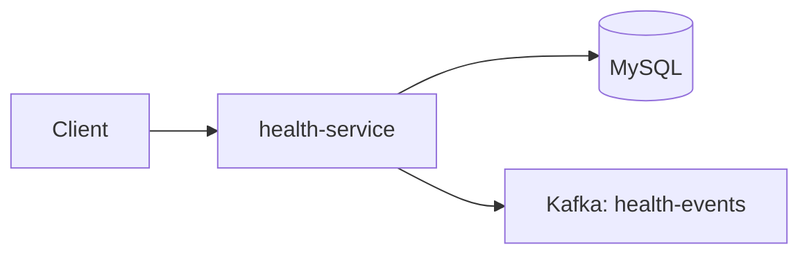

# Health Service

Tracks daily health logs, custom metrics, exercise plans, and workout logs.

**Port:** 8083

## Architecture



## Responsibilities

- Daily health logs (mood, sleep, notes)
- Custom health metrics and metric logs
- Exercise plan builder and activation
- Exercise log tracking
- Weekly health summary
- Publishes events on health and exercise activity

## API

| Method | Endpoint | Description |
|--------|----------|-------------|
| POST | `/api/health/logs` | Create health log |
| GET | `/api/health/logs` | List logs |
| GET | `/api/health/logs/today` | Today's log |
| GET | `/api/health/summary/weekly` | Weekly summary |
| POST | `/api/health/metrics` | Create metric |
| GET | `/api/health/metrics` | List metrics |
| POST | `/api/exercises/plans` | Create exercise plan |
| GET | `/api/exercises/plans/active` | Active plan |
| GET | `/api/exercises/plans/today` | Today's workout |
| POST | `/api/exercises/logs` | Log workout |
| GET | `/api/exercises/logs/today` | Today's logs |

Admin routes under `/api/health/admin` and `/api/exercises/admin`.

## Environment Variables

| Variable | Purpose |
|----------|---------|
| `DB_URL`, `DB_USERNAME`, `DB_PASSWORD` | MySQL |
| `JWT_SECRET` | Auth validation |
| `REDIS_HOST`, `REDIS_PORT` | Rate limiting |
| `KAFKA_BOOTSTRAP_SERVERS` | Event publishing |

## Run

```bash
mvn spring-boot:run
```
