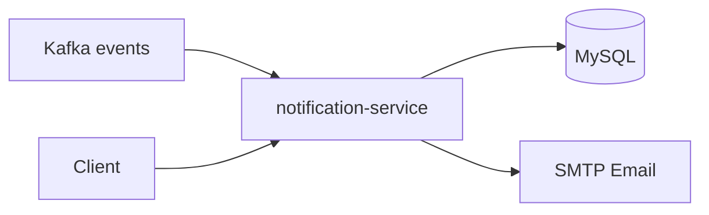

# Notification Service

Delivers in-app notifications, email alerts, daily insights, and streak tracking.

**Port:** 8085

## Architecture



## Responsibilities

- Consumes events from auth, task, health, and expense services
- Stores and serves in-app notifications
- Sends welcome and alert emails
- Daily insights and activity streaks
- Admin broadcast and notification stats

## Kafka Topics Consumed

| Topic | Source | Triggers |
|-------|--------|----------|
| `user-events` | auth-service | Welcome email |
| `task-events` | task-service | Task notifications |
| `health-events` | health-service | Health / exercise alerts |
| `expense-events` | expense-service | Budget exceeded alerts |

## API

| Method | Endpoint | Description |
|--------|----------|-------------|
| GET | `/api/notifications` | List notifications |
| GET | `/api/notifications/unread` | Unread list |
| GET | `/api/notifications/unread/count` | Unread count |
| PATCH | `/api/notifications/{id}/read` | Mark as read |
| PATCH | `/api/notifications/read-all` | Mark all read |
| DELETE | `/api/notifications/{id}` | Delete notification |
| GET | `/api/insights/today` | Today's insights |
| GET | `/api/insights/streaks` | Activity streaks |
| GET | `/api/insights/weekly` | Weekly insights |

Admin routes under `/api/notifications/admin`.

## Environment Variables

| Variable | Purpose |
|----------|---------|
| `DB_URL`, `DB_USERNAME`, `DB_PASSWORD` | MySQL |
| `JWT_SECRET` | Auth validation |
| `KAFKA_BOOTSTRAP_SERVERS` | Event consumption |
| `MAIL_USERNAME`, `MAIL_PASSWORD` | Email sending |
| `KAFKA_CONSUMER_GROUP` | Consumer group |

## Run

```bash
mvn spring-boot:run
```
