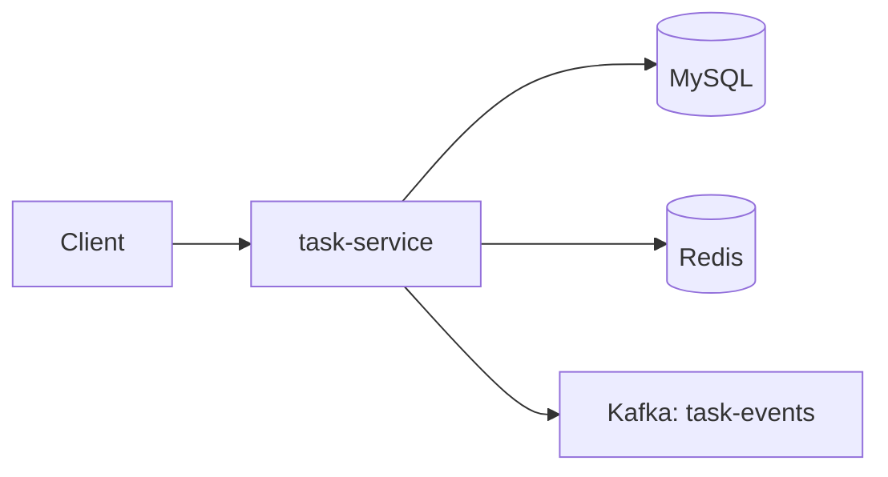

# Task Service

> **[← Back to Main Project](../../README.md)** | **[API Docs](../../docs/API.md#task-service-apis-8082)** | **[Architecture](../../docs/ARCHITECTURE.md)**

Manages user tasks with filtering, completion tracking, and admin oversight.

**Port:** 8082

## Architecture



## Responsibilities

- CRUD for tasks
- Mark complete / reopen
- Filter by status, priority, due date
- Publishes events on task create and complete
- Admin task lookup and platform stats

## API

| Method | Endpoint | Description |
|--------|----------|-------------|
| POST | `/api/tasks` | Create task |
| GET | `/api/tasks` | List tasks (filterable) |
| GET | `/api/tasks/{id}` | Get task |
| PUT | `/api/tasks/{id}` | Update task |
| PATCH | `/api/tasks/{id}/complete` | Complete task |
| PATCH | `/api/tasks/{id}/reopen` | Reopen task |
| DELETE | `/api/tasks/{id}` | Delete task |
| GET | `/api/tasks/admin/users/{userId}` | User tasks (admin) |
| GET | `/api/tasks/admin/stats` | Platform stats (admin) |

## Environment Variables

| Variable | Purpose |
|----------|---------|
| `DB_URL`, `DB_USERNAME`, `DB_PASSWORD` | MySQL |
| `JWT_SECRET` | Auth validation |
| `REDIS_HOST`, `REDIS_PORT` | Rate limiting |
| `KAFKA_BOOTSTRAP_SERVERS` | Event publishing |

## Database

Creates tables automatically in `tracker_tasks`:
- `tasks` - User tasks

**Full Schema**: [docs/DATABASE-SCHEMA.md](../../docs/DATABASE-SCHEMA.md#task-service-database-tracker_tasks)

## Run

```bash
# From backend/task-service directory
mvn spring-boot:run
```

## Troubleshooting

**Common issues:**
- Database not found: Create `tracker_tasks` database
- Connection errors: Verify MySQL is running
- Rate limit errors: Check Redis connection

**More help**: [docs/TROUBLESHOOTING.md](../../docs/TROUBLESHOOTING.md)

## Documentation

- [Complete API Reference](../../docs/API.md#task-service-apis-8082)
- [Kafka Events Published](../../docs/KAFKA-EVENTS.md#task-events)
