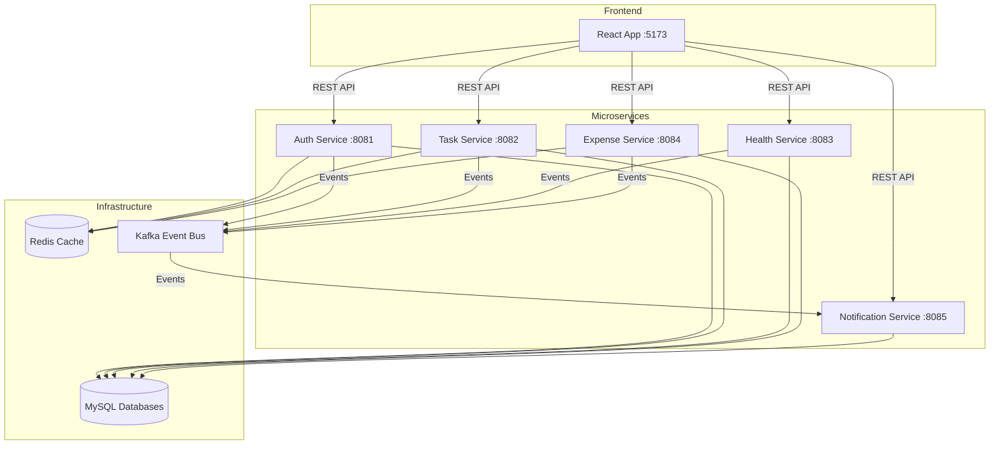

# System Architecture

High-level architecture and design decisions for Daily Life Tracker.

## Architecture Overview

Daily Life Tracker follows a **microservices architecture** with event-driven communication.



## Core Principles

### 1. Database per Service
Each microservice has its own MySQL database for data independence:
- `tracker_auth` - User accounts
- `tracker_tasks` - Tasks
- `tracker_health` - Health logs & exercises
- `tracker_expenses` - Expenses & budgets
- `tracker_notifications` - Notifications & streaks

**Benefits**: Independent deployment, schema evolution, fault isolation  
**Trade-off**: No foreign keys across services, eventual consistency

### 2. Event-Driven Communication
Services communicate asynchronously via Kafka:
- **Synchronous**: Frontend ↔ Services (REST)
- **Asynchronous**: Services ↔ Notification Service (Kafka events)

**Example Flow**:
```
User completes task 
→ Task Service updates DB & publishes TASK_COMPLETED 
→ Notification Service consumes event 
→ Creates notification & sends email
```

### 3. Stateless Services
- No session storage on servers
- JWT tokens for authentication
- Horizontal scaling ready

## Service Responsibilities

| Service | Domain | Key Features |
|---------|--------|--------------|
| **Auth** | User Management | Login, register, JWT tokens, OTP password reset |
| **Task** | Task Management | CRUD tasks, filtering, completion tracking |
| **Health** | Health Tracking | Daily logs, custom metrics, exercise plans |
| **Expense** | Finance | Expenses, budgets, CSV import, alerts |
| **Notification** | Notifications | Event consumer, in-app notifications, emails, insights |

## Technology Stack

### Backend
- **Java 21** + **Spring Boot 3.5**: Microservices framework
- **Spring Security** + **JWT**: Authentication
- **Spring Data JPA**: Database access
- **Spring Kafka**: Event streaming

### Frontend
- **React 19** + **Vite 8**: UI framework
- **Redux Toolkit**: State management
- **Tailwind CSS 4**: Styling
- **Axios**: HTTP client

### Infrastructure
- **MySQL 8+**: Persistent storage (one DB per service)
- **Redis 7+**: OTP storage, rate limiting, caching
- **Apache Kafka 3+**: Event bus for inter-service communication

## Security Design

### Authentication Flow
1. User logs in → Auth Service validates credentials
2. Auth Service generates JWT tokens (access + refresh)
3. Frontend stores tokens in localStorage
4. All API requests include `Authorization: Bearer <token>` header
5. Each service validates JWT independently (shared secret)

### Security Features
- **BCrypt password hashing** (strength 10)
- **JWT with expiration** (1 hour access, 7 days refresh)
- **Rate limiting** via Redis (prevents abuse)
- **CORS configuration** (frontend origin only)
- **Input validation** on all endpoints

## Data Flow Examples

### Task Completion Flow
```
1. Frontend → PATCH /api/tasks/42/complete → Task Service
2. Task Service → Updates DB (status = COMPLETED)
3. Task Service → Publishes TASK_COMPLETED to Kafka
4. Notification Service → Consumes event
5. Notification Service → Creates notification & updates streak
6. Frontend → GET /api/notifications/unread → Shows new notification
```

### Budget Alert Flow
```
1. Frontend → POST /api/expenses → Expense Service
2. Expense Service → Saves expense & checks budget
3. IF budget >= 80% → Publishes BUDGET_THRESHOLD_80
4. Notification Service → Consumes event
5. Notification Service → Creates alert & sends email
6. User receives notification and email
```

## Design Patterns

- **Repository Pattern**: Data access abstraction
- **Service Layer**: Business logic separation
- **DTO Pattern**: API models separate from entities
- **Event Sourcing**: Kafka events for audit trail
- **Cache-Aside**: Redis for frequently accessed data

## Kafka Topics

| Topic | Producer | Events | Consumer |
|-------|----------|--------|----------|
| `user-events` | Auth | USER_REGISTERED | Notification |
| `task-events` | Task | TASK_CREATED, TASK_COMPLETED | Notification |
| `health-events` | Health | HEALTH_LOG_CREATED, EXERCISE_COMPLETED | Notification |
| `expense-events` | Expense | EXPENSE_CREATED, BUDGET_THRESHOLD_80, BUDGET_EXCEEDED | Notification |

**Full event schemas**: [KAFKA-EVENTS.md](KAFKA-EVENTS.md)

## Trade-offs & Decisions

### Why Microservices?
**Pros**: Learning opportunity, clear boundaries, independent scaling  
**Cons**: More complex than monolith, distributed system challenges

**Decision**: Good for portfolio/learning project

### Shared JWT Secret
**Decision**: All services use same secret  
**Reason**: Simpler validation  
**Trade-off**: Less secure than public/private key pairs

### No API Gateway
**Decision**: Frontend calls services directly  
**Reason**: Simpler for local development  
**Trade-off**: Would need gateway for production

### Eventual Consistency
**Decision**: Accept slight delays in data consistency  
**Reason**: Microservices require asynchronous communication  
**Example**: Streak updates happen after event processing (< 1 second delay)

## Scaling Strategy

**Current**: Single instance of each service (local development)

**Future Scaling**:
- Run multiple service instances behind load balancer
- Kafka consumer groups for parallel event processing
- Redis cluster for distributed caching
- MySQL read replicas for read-heavy services

## Related Documentation

- [Setup Guide](SETUP.md) - How to run locally
- [API Documentation](API.md) - All endpoints
- [Kafka Events](KAFKA-EVENTS.md) - Event schemas
- [Database Schema](DATABASE-SCHEMA.md) - Data models
- [Troubleshooting](TROUBLESHOOTING.md) - Common issues
