# Database Schema Documentation

Database structure for all Daily Life Tracker microservices.

## Table of Contents

- [Overview](#overview)
- [Database Architecture](#database-architecture)
- [Auth Service Database](#auth-service-database-tracker_auth)
- [Task Service Database](#task-service-database-tracker_tasks)
- [Health Service Database](#health-service-database-tracker_health)
- [Expense Service Database](#expense-service-database-tracker_expenses)
- [Notification Service Database](#notification-service-database-tracker_notifications)
- [Relationships](#relationships)
- [Indexes](#indexes)

---

## Overview

The Daily Life Tracker follows the **Database per Service** pattern - each microservice has its own dedicated MySQL database. This ensures:

- **Independence**: Services can evolve their schemas independently
- **Isolation**: One service's database issues don't affect others
- **Scalability**: Databases can be scaled independently

### Databases

| Database | Service | Purpose |
|----------|---------|---------|
| `tracker_auth` | Auth Service | User authentication and profiles |
| `tracker_tasks` | Task Service | Task management |
| `tracker_health` | Health Service | Health logs and exercise plans |
| `tracker_expenses` | Expense Service | Expenses and budgets |
| `tracker_notifications` | Notification Service | Notifications and insights |

---

## Database Architecture

```mermaid
erDiagram
    %% Auth Service
    USERS {
        bigint id PK
        varchar name
        varchar email UK
        varchar password
        enum role
        timestamp created_at
        timestamp updated_at
    }
    
    %% Task Service
    TASKS {
        bigint id PK
        bigint user_id FK
        varchar title
        text description
        enum priority
        enum status
        datetime due_date
        datetime completed_at
        timestamp created_at
    }
    
    %% Health Service
    HEALTH_LOGS {
        bigint id PK
        bigint user_id FK
        date date UK
        enum mood
        decimal sleep_hours
        text notes
        timestamp created_at
    }
    
    EXERCISE_PLANS {
        bigint id PK
        bigint user_id FK
        varchar name
        text description
        date start_date
        date end_date
        enum status
    }
    
    EXERCISE_LOGS {
        bigint id PK
        bigint user_id FK
        bigint plan_id FK
        date date
        varchar exercise_name
        int sets_completed
        int reps_completed
    }
    
    %% Expense Service
    EXPENSES {
        bigint id PK
        bigint user_id FK
        decimal amount
        enum category
        text description
        date date
        timestamp created_at
    }
    
    BUDGETS {
        bigint id PK
        bigint user_id FK
        enum category UK
        decimal amount
        varchar month UK
    }
    
    %% Notification Service
    NOTIFICATIONS {
        bigint id PK
        bigint user_id FK
        varchar title
        text message
        enum type
        boolean is_read
        timestamp created_at
    }
    
    STREAKS {
        bigint id PK
        bigint user_id UK
        int task_streak
        int exercise_streak
        int health_log_streak
        date last_task_date
        date last_exercise_date
        date last_health_log_date
    }
```



---

## Auth Service Database (tracker_auth)

### users

Stores user account information and authentication data.

| Column | Type | Constraints | Description |
|--------|------|-------------|-------------|
| `id` | BIGINT | PRIMARY KEY, AUTO_INCREMENT | User ID |
| `name` | VARCHAR(100) | NOT NULL | Full name |
| `email` | VARCHAR(255) | NOT NULL, UNIQUE | Email address (login username) |
| `password` | VARCHAR(255) | NOT NULL | BCrypt hashed password |
| `role` | ENUM('USER', 'ADMIN') | NOT NULL, DEFAULT 'USER' | User role |
| `created_at` | TIMESTAMP | DEFAULT CURRENT_TIMESTAMP | Account creation time |
| `updated_at` | TIMESTAMP | DEFAULT CURRENT_TIMESTAMP ON UPDATE | Last update time |

**Indexes**:
- Primary Key: `id`
- Unique Index: `email`

**Example Data**:
```sql
INSERT INTO users (name, email, password, role) VALUES
('John Doe', 'john@example.com', '$2a$10$...', 'USER'),
('Admin User', 'admin@example.com', '$2a$10$...', 'ADMIN');
```

**Notes**:
- Passwords are hashed using BCrypt (strength 10)
- Email is used for login and must be unique
- Soft delete not implemented - accounts are hard deleted

---

## Task Service Database (tracker_tasks)

### tasks

Stores user tasks and their completion status.

| Column | Type | Constraints | Description |
|--------|------|-------------|-------------|
| `id` | BIGINT | PRIMARY KEY, AUTO_INCREMENT | Task ID |
| `user_id` | BIGINT | NOT NULL, INDEX | Reference to user (from auth DB) |
| `title` | VARCHAR(255) | NOT NULL | Task title |
| `description` | TEXT | NULL | Detailed description |
| `priority` | ENUM('LOW', 'MEDIUM', 'HIGH') | NOT NULL, DEFAULT 'MEDIUM' | Task priority |
| `status` | ENUM('TODO', 'IN_PROGRESS', 'COMPLETED') | NOT NULL, DEFAULT 'TODO' | Current status |
| `due_date` | DATETIME | NULL | Due date and time |
| `completed_at` | DATETIME | NULL | Completion timestamp |
| `created_at` | TIMESTAMP | DEFAULT CURRENT_TIMESTAMP | Creation time |
| `updated_at` | TIMESTAMP | DEFAULT CURRENT_TIMESTAMP ON UPDATE | Last update time |

**Indexes**:
- Primary Key: `id`
- Index: `user_id`
- Index: `user_id, status`
- Index: `user_id, due_date`

**Example Data**:
```sql
INSERT INTO tasks (user_id, title, description, priority, status, due_date) VALUES
(1, 'Complete documentation', 'Write README and API docs', 'HIGH', 'IN_PROGRESS', '2026-09-15 18:00:00'),
(1, 'Review pull requests', 'Review open PRs', 'MEDIUM', 'TODO', '2026-09-12 12:00:00'),
(1, 'Fix bug in auth', 'Token expiration issue', 'HIGH', 'COMPLETED', NULL);
```

**Business Rules**:
- `completed_at` is set when status changes to COMPLETED
- Tasks can be reopened (status changed from COMPLETED to TODO)
- Due dates are optional

---

## Health Service Database (tracker_health)

### health_logs

Daily health tracking logs.

| Column | Type | Constraints | Description |
|--------|------|-------------|-------------|
| `id` | BIGINT | PRIMARY KEY, AUTO_INCREMENT | Log ID |
| `user_id` | BIGINT | NOT NULL, INDEX | Reference to user |
| `date` | DATE | NOT NULL | Log date |
| `mood` | ENUM('HAPPY', 'NEUTRAL', 'SAD', 'ANXIOUS', 'ENERGETIC') | NOT NULL | Daily mood |
| `sleep_hours` | DECIMAL(3,1) | NOT NULL | Hours of sleep (e.g., 7.5) |
| `notes` | TEXT | NULL | Optional notes |
| `created_at` | TIMESTAMP | DEFAULT CURRENT_TIMESTAMP | Creation time |
| `updated_at` | TIMESTAMP | DEFAULT CURRENT_TIMESTAMP ON UPDATE | Last update time |

**Constraints**:
- UNIQUE(`user_id`, `date`) - One log per user per day

**Indexes**:
- Primary Key: `id`
- Unique Index: `user_id, date`
- Index: `date`

**Example Data**:
```sql
INSERT INTO health_logs (user_id, date, mood, sleep_hours, notes) VALUES
(1, '2026-09-10', 'HAPPY', 7.5, 'Feeling great today!'),
(1, '2026-09-09', 'NEUTRAL', 6.5, 'A bit tired'),
(1, '2026-09-08', 'ENERGETIC', 8.0, 'Best sleep in weeks');
```

### custom_health_metrics

User-defined health metrics (e.g., water intake, weight, blood pressure).

| Column | Type | Constraints | Description |
|--------|------|-------------|-------------|
| `id` | BIGINT | PRIMARY KEY, AUTO_INCREMENT | Metric ID |
| `user_id` | BIGINT | NOT NULL, INDEX | Reference to user |
| `name` | VARCHAR(100) | NOT NULL | Metric name (e.g., "Water Intake") |
| `unit` | VARCHAR(50) | NOT NULL | Unit of measurement (e.g., "liters") |
| `target_value` | DECIMAL(10,2) | NULL | Target/goal value |
| `created_at` | TIMESTAMP | DEFAULT CURRENT_TIMESTAMP | Creation time |

**Example Data**:
```sql
INSERT INTO custom_health_metrics (user_id, name, unit, target_value) VALUES
(1, 'Water Intake', 'liters', 3.0),
(1, 'Weight', 'kg', 70.0);
```

### custom_health_metric_logs

Logs for custom metrics.

| Column | Type | Constraints | Description |
|--------|------|-------------|-------------|
| `id` | BIGINT | PRIMARY KEY, AUTO_INCREMENT | Log ID |
| `metric_id` | BIGINT | NOT NULL, FK | Reference to custom_health_metrics |
| `user_id` | BIGINT | NOT NULL, INDEX | Reference to user |
| `date` | DATE | NOT NULL | Log date |
| `value` | DECIMAL(10,2) | NOT NULL | Recorded value |
| `created_at` | TIMESTAMP | DEFAULT CURRENT_TIMESTAMP | Creation time |

### exercise_plans

Exercise workout plans.

| Column | Type | Constraints | Description |
|--------|------|-------------|-------------|
| `id` | BIGINT | PRIMARY KEY, AUTO_INCREMENT | Plan ID |
| `user_id` | BIGINT | NOT NULL, INDEX | Reference to user |
| `name` | VARCHAR(255) | NOT NULL | Plan name |
| `description` | TEXT | NULL | Plan description |
| `start_date` | DATE | NOT NULL | Plan start date |
| `end_date` | DATE | NOT NULL | Plan end date |
| `days_of_week` | VARCHAR(255) | NOT NULL | Comma-separated days (MONDAY,WEDNESDAY,FRIDAY) |
| `status` | ENUM('DRAFT', 'ACTIVE', 'COMPLETED', 'CANCELLED') | NOT NULL, DEFAULT 'DRAFT' | Plan status |
| `created_at` | TIMESTAMP | DEFAULT CURRENT_TIMESTAMP | Creation time |

**Business Rules**:
- Only one ACTIVE plan per user at a time
- Plans automatically become COMPLETED when end_date passes

**Example Data**:
```sql
INSERT INTO exercise_plans (user_id, name, description, start_date, end_date, days_of_week, status) VALUES
(1, 'Morning Workout', 'Full body workout', '2026-09-10', '2026-10-10', 'MONDAY,WEDNESDAY,FRIDAY', 'ACTIVE');
```

### plan_exercises

Exercises within a plan.

| Column | Type | Constraints | Description |
|--------|------|-------------|-------------|
| `id` | BIGINT | PRIMARY KEY, AUTO_INCREMENT | Exercise ID |
| `plan_id` | BIGINT | NOT NULL, FK | Reference to exercise_plans |
| `name` | VARCHAR(255) | NOT NULL | Exercise name |
| `sets` | INT | NOT NULL | Number of sets |
| `reps` | INT | NULL | Repetitions per set (if applicable) |
| `duration_minutes` | INT | NULL | Duration in minutes (for cardio) |
| `order_index` | INT | NOT NULL, DEFAULT 0 | Display order |

**Example Data**:
```sql
INSERT INTO plan_exercises (plan_id, name, sets, reps, duration_minutes, order_index) VALUES
(1, 'Push-ups', 3, 15, NULL, 0),
(1, 'Squats', 3, 20, NULL, 1),
(1, 'Running', 1, NULL, 30, 2);
```

### exercise_logs

Completed exercise logs.

| Column | Type | Constraints | Description |
|--------|------|-------------|-------------|
| `id` | BIGINT | PRIMARY KEY, AUTO_INCREMENT | Log ID |
| `user_id` | BIGINT | NOT NULL, INDEX | Reference to user |
| `plan_id` | BIGINT | NULL, FK | Reference to exercise_plans (if part of plan) |
| `date` | DATE | NOT NULL | Exercise date |
| `exercise_name` | VARCHAR(255) | NOT NULL | Exercise name |
| `sets_completed` | INT | NOT NULL | Sets completed |
| `reps_completed` | INT | NULL | Reps completed |
| `duration_minutes` | INT | NULL | Duration completed |
| `notes` | TEXT | NULL | Optional notes |
| `created_at` | TIMESTAMP | DEFAULT CURRENT_TIMESTAMP | Log time |

**Indexes**:
- Primary Key: `id`
- Index: `user_id, date`

---

## Expense Service Database (tracker_expenses)

### expenses

User expenses.

| Column | Type | Constraints | Description |
|--------|------|-------------|-------------|
| `id` | BIGINT | PRIMARY KEY, AUTO_INCREMENT | Expense ID |
| `user_id` | BIGINT | NOT NULL, INDEX | Reference to user |
| `amount` | DECIMAL(10,2) | NOT NULL | Expense amount |
| `category` | ENUM('FOOD', 'TRANSPORT', 'ENTERTAINMENT', 'UTILITIES', 'HEALTHCARE', 'SHOPPING', 'OTHER') | NOT NULL | Expense category |
| `description` | TEXT | NULL | Description |
| `date` | DATE | NOT NULL | Expense date |
| `created_at` | TIMESTAMP | DEFAULT CURRENT_TIMESTAMP | Creation time |
| `updated_at` | TIMESTAMP | DEFAULT CURRENT_TIMESTAMP ON UPDATE | Last update time |

**Indexes**:
- Primary Key: `id`
- Index: `user_id, date`
- Index: `user_id, category`
- Index: `user_id, date, category`

**Example Data**:
```sql
INSERT INTO expenses (user_id, amount, category, description, date) VALUES
(1, 50.00, 'FOOD', 'Lunch at restaurant', '2026-09-10'),
(1, 30.00, 'TRANSPORT', 'Uber ride', '2026-09-10'),
(1, 100.00, 'UTILITIES', 'Electricity bill', '2026-09-05');
```

### budgets

Monthly budgets by category.

| Column | Type | Constraints | Description |
|--------|------|-------------|-------------|
| `id` | BIGINT | PRIMARY KEY, AUTO_INCREMENT | Budget ID |
| `user_id` | BIGINT | NOT NULL, INDEX | Reference to user |
| `category` | ENUM('FOOD', 'TRANSPORT', 'ENTERTAINMENT', 'UTILITIES', 'HEALTHCARE', 'SHOPPING', 'OTHER') | NOT NULL | Budget category |
| `amount` | DECIMAL(10,2) | NOT NULL | Budget amount |
| `month` | VARCHAR(7) | NOT NULL | Month in YYYY-MM format |
| `created_at` | TIMESTAMP | DEFAULT CURRENT_TIMESTAMP | Creation time |
| `updated_at` | TIMESTAMP | DEFAULT CURRENT_TIMESTAMP ON UPDATE | Last update time |

**Constraints**:
- UNIQUE(`user_id`, `category`, `month`) - One budget per category per month

**Indexes**:
- Primary Key: `id`
- Unique Index: `user_id, category, month`

**Example Data**:
```sql
INSERT INTO budgets (user_id, category, amount, month) VALUES
(1, 'FOOD', 500.00, '2026-09'),
(1, 'TRANSPORT', 300.00, '2026-09'),
(1, 'ENTERTAINMENT', 200.00, '2026-09');
```

**Business Logic**:
- Budget status calculated in real-time by querying expenses
- Alerts triggered at 80% and 100% thresholds

---

## Notification Service Database (tracker_notifications)

### notifications

In-app notifications.

| Column | Type | Constraints | Description |
|--------|------|-------------|-------------|
| `id` | BIGINT | PRIMARY KEY, AUTO_INCREMENT | Notification ID |
| `user_id` | BIGINT | NOT NULL, INDEX | Reference to user |
| `title` | VARCHAR(255) | NOT NULL | Notification title |
| `message` | TEXT | NOT NULL | Notification message |
| `type` | ENUM('TASK', 'HEALTH', 'EXERCISE', 'EXPENSE', 'SYSTEM', 'ACHIEVEMENT') | NOT NULL | Notification type |
| `is_read` | BOOLEAN | NOT NULL, DEFAULT FALSE | Read status |
| `created_at` | TIMESTAMP | DEFAULT CURRENT_TIMESTAMP | Creation time |

**Indexes**:
- Primary Key: `id`
- Index: `user_id, is_read`
- Index: `user_id, created_at`

**Example Data**:
```sql
INSERT INTO notifications (user_id, title, message, type, is_read) VALUES
(1, 'Task Completed', 'You completed: Complete documentation', 'TASK', FALSE),
(1, 'Budget Alert', 'Your FOOD budget is 90% used', 'EXPENSE', FALSE),
(1, 'Welcome!', 'Welcome to Daily Life Tracker', 'SYSTEM', TRUE);
```

### activity_streaks

User activity streak tracking.

| Column | Type | Constraints | Description |
|--------|------|-------------|-------------|
| `id` | BIGINT | PRIMARY KEY, AUTO_INCREMENT | Record ID |
| `user_id` | BIGINT | NOT NULL, UNIQUE | Reference to user |
| `task_streak` | INT | NOT NULL, DEFAULT 0 | Current task completion streak |
| `task_longest_streak` | INT | NOT NULL, DEFAULT 0 | Longest task streak |
| `exercise_streak` | INT | NOT NULL, DEFAULT 0 | Current exercise streak |
| `exercise_longest_streak` | INT | NOT NULL, DEFAULT 0 | Longest exercise streak |
| `health_log_streak` | INT | NOT NULL, DEFAULT 0 | Current health log streak |
| `health_log_longest_streak` | INT | NOT NULL, DEFAULT 0 | Longest health log streak |
| `last_task_date` | DATE | NULL | Last task completion date |
| `last_exercise_date` | DATE | NULL | Last exercise date |
| `last_health_log_date` | DATE | NULL | Last health log date |
| `updated_at` | TIMESTAMP | DEFAULT CURRENT_TIMESTAMP ON UPDATE | Last update time |

**Indexes**:
- Primary Key: `id`
- Unique Index: `user_id`

**Example Data**:
```sql
INSERT INTO activity_streaks (user_id, task_streak, task_longest_streak, last_task_date) VALUES
(1, 7, 15, '2026-09-10');
```

**Business Logic**:
- Streak increments if activity happens on consecutive days
- Streak resets if a day is missed
- Longest streak tracks all-time best

---

## Relationships

### Cross-Database References

Since each service has its own database, foreign keys cannot be enforced across databases. Instead, services maintain `user_id` references:

```
users (tracker_auth)
  ↓ user_id
  ├─→ tasks (tracker_tasks)
  ├─→ health_logs (tracker_health)
  ├─→ expenses (tracker_expenses)
  └─→ notifications (tracker_notifications)
```

**Important**: 
- No FK constraints across databases
- Referential integrity maintained at application level
- Deleting a user requires cleanup across all services

---

## Indexes

### Performance Optimization

**Critical Indexes**:

1. **User ID indexes** on all tables with `user_id`
2. **Date indexes** for time-based queries
3. **Composite indexes** for common filter combinations

**Example Query Optimizations**:

```sql
-- Get user's tasks by status (uses index: user_id, status)
SELECT * FROM tasks WHERE user_id = 1 AND status = 'TODO';

-- Get expenses in date range (uses index: user_id, date)
SELECT * FROM expenses 
WHERE user_id = 1 
AND date BETWEEN '2026-09-01' AND '2026-09-30';

-- Get unread notifications (uses index: user_id, is_read)
SELECT * FROM notifications 
WHERE user_id = 1 AND is_read = FALSE
ORDER BY created_at DESC;
```

---

## Schema Migrations

### Initial Setup

Tables are auto-created by Spring Boot JPA on first run:

```yaml
# application.yml
spring:
  jpa:
    hibernate:
      ddl-auto: update  # Auto-create/update tables
```

### Production Recommendation

For production, use migration tools like **Flyway** or **Liquibase**:

```yaml
spring:
  jpa:
    hibernate:
      ddl-auto: validate  # Only validate, don't auto-create
  flyway:
    enabled: true
    locations: classpath:db/migration
```

---

## Sample Data Scripts

### Create Sample User and Data

```sql
-- Auth DB
USE tracker_auth;
INSERT INTO users (name, email, password, role) VALUES
('Demo User', 'demo@example.com', '$2a$10$...', 'USER');

SET @user_id = LAST_INSERT_ID();

-- Task DB
USE tracker_tasks;
INSERT INTO tasks (user_id, title, priority, status) VALUES
(@user_id, 'Sample Task', 'HIGH', 'TODO');

-- Health DB
USE tracker_health;
INSERT INTO health_logs (user_id, date, mood, sleep_hours) VALUES
(@user_id, CURDATE(), 'HAPPY', 8.0);

-- Expense DB
USE tracker_expenses;
INSERT INTO expenses (user_id, amount, category, description, date) VALUES
(@user_id, 25.00, 'FOOD', 'Lunch', CURDATE());

-- Notification DB
USE tracker_notifications;
INSERT INTO notifications (user_id, title, message, type) VALUES
(@user_id, 'Welcome', 'Welcome to Daily Life Tracker!', 'SYSTEM');
```

---

## Backup and Restore

### Backup All Databases

```bash
# Windows (PowerShell)
mysqldump -u tracker_user -p --databases tracker_auth tracker_tasks tracker_health tracker_expenses tracker_notifications > backup.sql

# Mac/Linux
mysqldump -u tracker_user -p --databases tracker_auth tracker_tasks tracker_health tracker_expenses tracker_notifications > backup.sql
```

### Restore

```bash
mysql -u tracker_user -p < backup.sql
```

---

**Related Documentation**:
- [Setup Guide](SETUP.md)
- [API Documentation](API.md)
- [Kafka Events](KAFKA-EVENTS.md)
