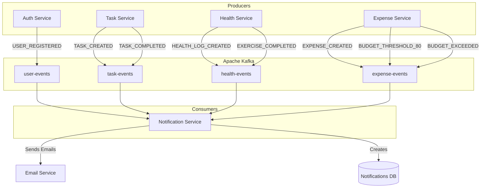
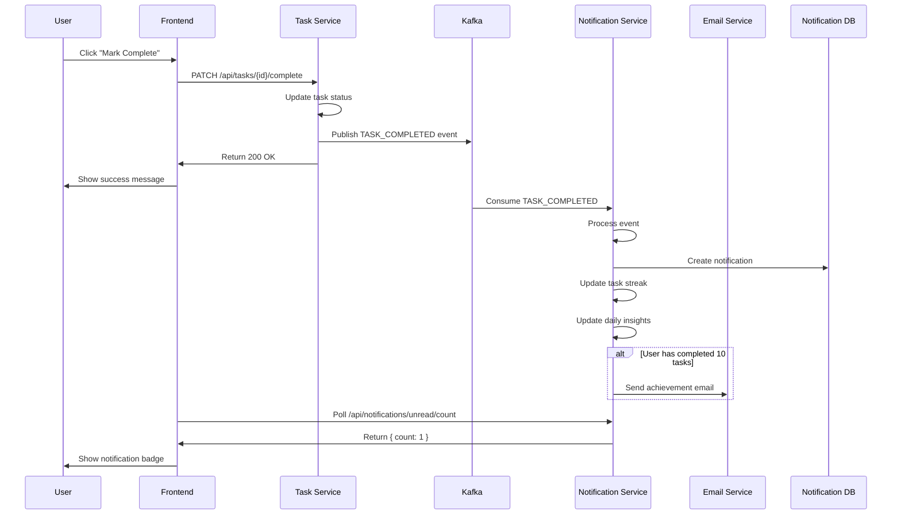
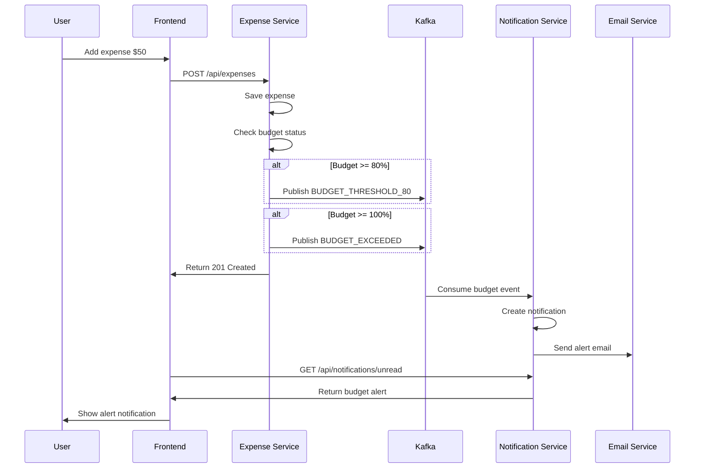

# Kafka Events Documentation

Event-driven architecture and message flows in Daily Life Tracker.

## Table of Contents

- [Overview](#overview)
- [Event Flow Architecture](#event-flow-architecture)
- [Topics and Events](#topics-and-events)
- [Event Schemas](#event-schemas)
- [Producer Services](#producer-services)
- [Consumer Services](#consumer-services)
- [Event Processing Flow](#event-processing-flow)

---

## Overview

The Daily Life Tracker uses **Apache Kafka** for asynchronous, event-driven communication between microservices. This architecture provides:

- **Decoupling**: Services don't need to know about each other
- **Scalability**: Easy to add new event consumers
- **Reliability**: Events are persisted and can be replayed
- **Real-time Processing**: Instant notifications and updates

### Key Concepts

- **Topics**: Named channels for event streams
- **Producers**: Services that publish events
- **Consumers**: Services that subscribe to events
- **Events**: JSON messages with structured data

---

## Event Flow Architecture



---

## Topics and Events

### 1. user-events

**Purpose**: User lifecycle events  
**Producer**: Auth Service  
**Consumer**: Notification Service

| Event Type | Description | Trigger |
|------------|-------------|---------|
| `USER_REGISTERED` | New user registration | User completes registration |

---

### 2. task-events

**Purpose**: Task lifecycle events  
**Producer**: Task Service  
**Consumer**: Notification Service

| Event Type | Description | Trigger |
|------------|-------------|---------|
| `TASK_CREATED` | New task created | User creates a task |
| `TASK_COMPLETED` | Task marked complete | User completes a task |

---

### 3. health-events

**Purpose**: Health and exercise events  
**Producer**: Health Service  
**Consumer**: Notification Service

| Event Type | Description | Trigger |
|------------|-------------|---------|
| `HEALTH_LOG_CREATED` | Daily health log recorded | User logs health data |
| `EXERCISE_COMPLETED` | Workout completed | User completes exercise |

---

### 4. expense-events

**Purpose**: Expense and budget events  
**Producer**: Expense Service  
**Consumer**: Notification Service

| Event Type | Description | Trigger |
|------------|-------------|---------|
| `EXPENSE_CREATED` | New expense added | User adds an expense |
| `BUDGET_THRESHOLD_80` | Budget 80% used | Expense reaches 80% of budget |
| `BUDGET_EXCEEDED` | Budget limit exceeded | Expense exceeds 100% of budget |

---

## Event Schemas

### USER_REGISTERED

**Topic**: `user-events`  
**Producer**: Auth Service

```json
{
  "eventType": "USER_REGISTERED",
  "timestamp": "2026-09-10T12:00:00Z",
  "data": {
    "userId": 1,
    "email": "john@example.com",
    "name": "John Doe",
    "registeredAt": "2026-09-10T12:00:00Z"
  }
}
```

**Actions Triggered**:
- ✅ Send welcome email
- ✅ Create welcome notification

---

### TASK_CREATED

**Topic**: `task-events`  
**Producer**: Task Service

```json
{
  "eventType": "TASK_CREATED",
  "timestamp": "2026-09-10T13:30:00Z",
  "data": {
    "taskId": 42,
    "userId": 1,
    "title": "Complete documentation",
    "priority": "HIGH",
    "dueDate": "2026-09-15T18:00:00Z",
    "createdAt": "2026-09-10T13:30:00Z"
  }
}
```

**Actions Triggered**:
- ✅ Create in-app notification

---

### TASK_COMPLETED

**Topic**: `task-events`  
**Producer**: Task Service

```json
{
  "eventType": "TASK_COMPLETED",
  "timestamp": "2026-09-10T15:30:00Z",
  "data": {
    "taskId": 42,
    "userId": 1,
    "title": "Complete documentation",
    "completedAt": "2026-09-10T15:30:00Z"
  }
}
```

**Actions Triggered**:
- ✅ Create completion notification
- ✅ Update task streak counter
- ✅ Calculate daily insights

---

### HEALTH_LOG_CREATED

**Topic**: `health-events`  
**Producer**: Health Service

```json
{
  "eventType": "HEALTH_LOG_CREATED",
  "timestamp": "2026-09-10T08:00:00Z",
  "data": {
    "healthLogId": 15,
    "userId": 1,
    "date": "2026-09-10",
    "mood": "HAPPY",
    "sleepHours": 7.5,
    "createdAt": "2026-09-10T08:00:00Z"
  }
}
```

**Actions Triggered**:
- ✅ Update health streak counter
- ✅ Calculate weekly health summary

---

### EXERCISE_COMPLETED

**Topic**: `health-events`  
**Producer**: Health Service

```json
{
  "eventType": "EXERCISE_COMPLETED",
  "timestamp": "2026-09-10T07:00:00Z",
  "data": {
    "exerciseLogId": 23,
    "userId": 1,
    "planId": 5,
    "planName": "Morning Workout",
    "exerciseName": "Push-ups",
    "setsCompleted": 3,
    "completedAt": "2026-09-10T07:00:00Z"
  }
}
```

**Actions Triggered**:
- ✅ Create completion notification
- ✅ Update exercise streak counter
- ✅ Update daily insights

---

### EXPENSE_CREATED

**Topic**: `expense-events`  
**Producer**: Expense Service

```json
{
  "eventType": "EXPENSE_CREATED",
  "timestamp": "2026-09-10T14:30:00Z",
  "data": {
    "expenseId": 78,
    "userId": 1,
    "amount": 50.00,
    "category": "FOOD",
    "description": "Lunch",
    "date": "2026-09-10",
    "createdAt": "2026-09-10T14:30:00Z"
  }
}
```

**Actions Triggered**:
- ✅ Check budget status
- ✅ Trigger budget alerts if thresholds crossed

---

### BUDGET_THRESHOLD_80

**Topic**: `expense-events`  
**Producer**: Expense Service

```json
{
  "eventType": "BUDGET_THRESHOLD_80",
  "timestamp": "2026-09-10T14:30:00Z",
  "data": {
    "userId": 1,
    "category": "FOOD",
    "budgetAmount": 500.00,
    "spentAmount": 420.00,
    "remainingAmount": 80.00,
    "percentageUsed": 84,
    "month": "2026-09"
  }
}
```

**Actions Triggered**:
- ⚠️ Send warning notification
- ⚠️ Send warning email

---

### BUDGET_EXCEEDED

**Topic**: `expense-events`  
**Producer**: Expense Service

```json
{
  "eventType": "BUDGET_EXCEEDED",
  "timestamp": "2026-09-10T18:00:00Z",
  "data": {
    "userId": 1,
    "category": "FOOD",
    "budgetAmount": 500.00,
    "spentAmount": 520.00,
    "exceededBy": 20.00,
    "percentageUsed": 104,
    "month": "2026-09"
  }
}
```

**Actions Triggered**:
- 🚨 Send critical notification
- 🚨 Send alert email

---

## Producer Services

### Auth Service (Port 8081)

**Publishes to**: `user-events`

**Events**:
- `USER_REGISTERED` - When user completes registration

**Implementation**:
```java
// UserEventProducer.java
@Service
public class UserEventProducer {
    
    @Autowired
    private KafkaTemplate<String, String> kafkaTemplate;
    
    public void publishUserRegisteredEvent(User user) {
        UserRegisteredEvent event = new UserRegisteredEvent(
            user.getId(),
            user.getEmail(),
            user.getName(),
            user.getCreatedAt()
        );
        
        kafkaTemplate.send("user-events", 
            objectMapper.writeValueAsString(event));
    }
}
```

---

### Task Service (Port 8082)

**Publishes to**: `task-events`

**Events**:
- `TASK_CREATED` - When task is created
- `TASK_COMPLETED` - When task is marked complete

**Configuration**:
```properties
KAFKA_BOOTSTRAP_SERVERS=localhost:9092
TASK_EVENTS_TOPIC=task-events
```

---

### Health Service (Port 8083)

**Publishes to**: `health-events`

**Events**:
- `HEALTH_LOG_CREATED` - When health log is recorded
- `EXERCISE_COMPLETED` - When exercise is logged

---

### Expense Service (Port 8084)

**Publishes to**: `expense-events`

**Events**:
- `EXPENSE_CREATED` - When expense is added
- `BUDGET_THRESHOLD_80` - When budget reaches 80%
- `BUDGET_EXCEEDED` - When budget exceeds 100%

---

## Consumer Services

### Notification Service (Port 8085)

**Subscribes to**:
- `user-events`
- `task-events`
- `health-events`
- `expense-events`

**Consumer Group**: `notification-service-group`

**Implementation**:
```java
// EventConsumer.java
@Service
public class EventConsumer {
    
    @KafkaListener(topics = "user-events", groupId = "notification-service-group")
    public void consumeUserEvent(String message) {
        UserEvent event = objectMapper.readValue(message, UserEvent.class);
        
        if ("USER_REGISTERED".equals(event.getEventType())) {
            // Send welcome email
            emailService.sendWelcomeEmail(event.getData());
            
            // Create in-app notification
            notificationService.createNotification(event.getData());
        }
    }
    
    @KafkaListener(topics = "task-events", groupId = "notification-service-group")
    public void consumeTaskEvent(String message) {
        TaskEvent event = objectMapper.readValue(message, TaskEvent.class);
        
        switch (event.getEventType()) {
            case "TASK_CREATED":
                notificationService.createTaskNotification(event.getData());
                break;
            case "TASK_COMPLETED":
                notificationService.createCompletionNotification(event.getData());
                streakService.updateTaskStreak(event.getData().getUserId());
                break;
        }
    }
    
    // Similar listeners for health-events and expense-events
}
```

**Configuration**:
```properties
KAFKA_BOOTSTRAP_SERVERS=localhost:9092
KAFKA_CONSUMER_GROUP=notification-service-group
```

---

## Event Processing Flow

### Example: User Completes a Task



### Example: Budget Alert Flow



---

## Configuration

### Producer Configuration

**application.yml** (for producer services):

```yaml
spring:
  kafka:
    bootstrap-servers: ${KAFKA_BOOTSTRAP_SERVERS:localhost:9092}
    producer:
      key-serializer: org.apache.kafka.common.serialization.StringSerializer
      value-serializer: org.apache.kafka.common.serialization.StringSerializer
      acks: all
      retries: 3
```

### Consumer Configuration

**application.yml** (for notification service):

```yaml
spring:
  kafka:
    bootstrap-servers: ${KAFKA_BOOTSTRAP_SERVERS:localhost:9092}
    consumer:
      group-id: ${KAFKA_CONSUMER_GROUP:notification-service-group}
      key-deserializer: org.apache.kafka.common.serialization.StringDeserializer
      value-deserializer: org.apache.kafka.common.serialization.StringDeserializer
      auto-offset-reset: earliest
      enable-auto-commit: true
```

---

## Monitoring Events

### View Messages in a Topic

**Windows:**
```powershell
cd C:\kafka_2.13-3.x.x
bin\windows\kafka-console-consumer.bat --bootstrap-server localhost:9092 --topic task-events --from-beginning
```

**Mac/Linux:**
```bash
cd /path/to/kafka
bin/kafka-console-consumer.sh --bootstrap-server localhost:9092 --topic task-events --from-beginning
```

### Check Consumer Group Status

```bash
bin/kafka-consumer-groups.sh --bootstrap-server localhost:9092 --describe --group notification-service-group
```

### List All Topics

```bash
bin/kafka-topics.sh --list --bootstrap-server localhost:9092
```

---

## Event Best Practices

### 1. Event Structure

✅ **Always include**:
- `eventType`: String identifier
- `timestamp`: ISO 8601 format
- `data`: Relevant payload

✅ **Use consistent naming**:
- PascalCase for event types (e.g., `TASK_COMPLETED`)
- camelCase for field names

### 2. Idempotency

Consumers should be **idempotent** - processing the same event multiple times should have the same effect.

Example:
```java
// Check if notification already exists before creating
if (!notificationRepository.existsByEventId(event.getId())) {
    notificationRepository.save(notification);
}
```

### 3. Error Handling

```java
@KafkaListener(topics = "task-events")
public void consumeTaskEvent(String message) {
    try {
        // Process event
    } catch (Exception e) {
        log.error("Error processing task event: {}", message, e);
        // Send to dead letter queue or retry
    }
}
```

### 4. Monitoring

- Log all published events
- Track consumer lag
- Monitor failed message processing
- Set up alerts for event processing delays

---

## Troubleshooting

### Events Not Being Consumed

**Check**:
1. Kafka is running
2. Topic exists: `bin/kafka-topics.sh --list`
3. Consumer group is active
4. No errors in notification service logs

### Messages Stuck in Topic

```bash
# Check consumer group lag
bin/kafka-consumer-groups.sh --bootstrap-server localhost:9092 \
  --describe --group notification-service-group
```

If `LAG` is high, notification service may be slow or crashed.

### Delete Topic (Development Only)

```bash
bin/kafka-topics.sh --delete --topic topic-name --bootstrap-server localhost:9092
```

---

## Future Events (Potential Additions)

Ideas for expanding the event system:

- `USER_DELETED` - Clean up user data across services
- `TASK_DUE_SOON` - Reminder notifications
- `EXERCISE_PLAN_EXPIRED` - Create new plan reminder
- `MONTHLY_REPORT_READY` - Send monthly summary email
- `ACHIEVEMENT_UNLOCKED` - Gamification events

---

**Related Documentation**:
- [API Documentation](API.md)
- [Setup Guide](SETUP.md)
- [Troubleshooting](TROUBLESHOOTING.md)
