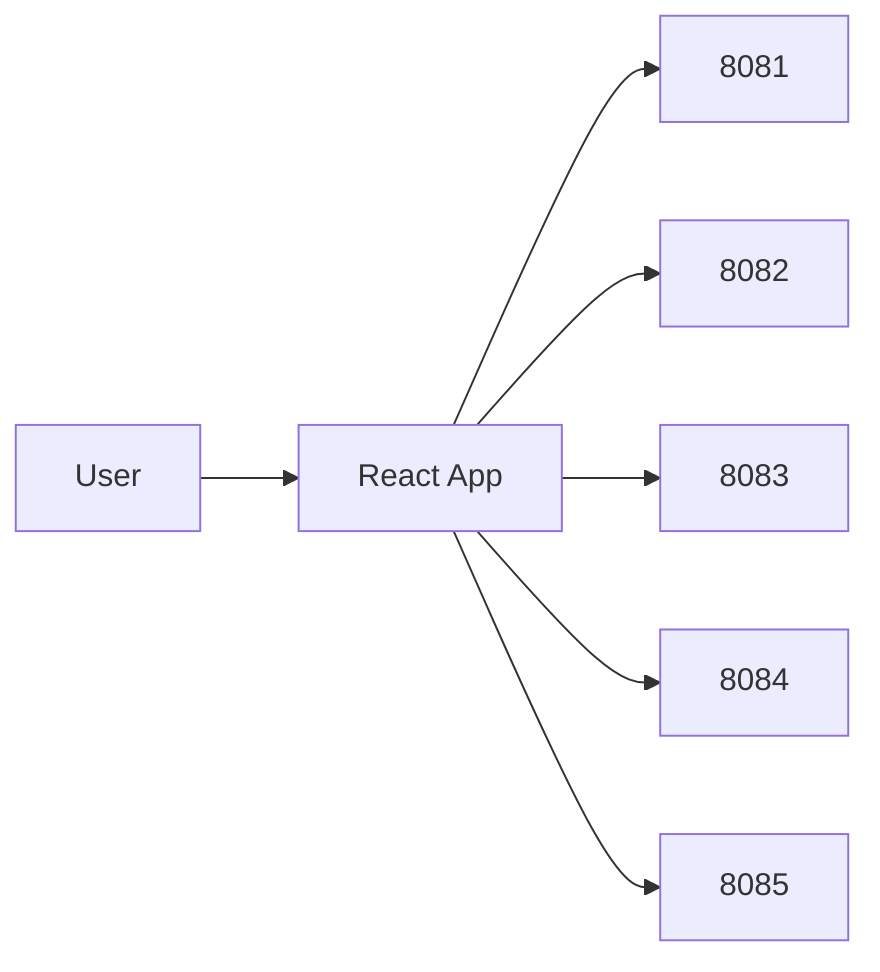

# Tracker App (Frontend)

> **[← Back to Main Project](../../README.md)** | **[Architecture](../../docs/ARCHITECTURE.md)**

React SPA for the Daily Life Tracker platform. Talks to all backend microservices via REST.

**Port:** 5173 (dev)

## Architecture



## Features

| Route | Page |
|-------|------|
| `/` | Dashboard |
| `/tasks` | Task management |
| `/health` | Health logs |
| `/exercise` | Exercise plans and logs |
| `/expenses` | Expenses and budgets |
| `/notifications` | Notifications and insights |
| `/profile` | User profile |
| `/admin` | Admin dashboard |

Auth routes: `/login`, `/register`, `/forgot-password`, `/verify-otp`, `/reset-password`

## Stack

React 19, Vite 8, Redux Toolkit, React Router 7, Tailwind CSS 4, Axios

## Project Structure

```
src/
├── features/          # Feature modules (auth, tasks, health, etc.)
├── components/        # Shared components (layout, protected routes)
├── app/              # Redux store configuration
└── utils/            # Utilities and constants
```

## Environment Variables

Copy `.env.example` to `.env`:

```
VITE_AUTH_SERVICE_URL=http://localhost:8081
VITE_TASK_SERVICE_URL=http://localhost:8082
VITE_HEALTH_SERVICE_URL=http://localhost:8083
VITE_EXPENSE_SERVICE_URL=http://localhost:8084
VITE_NOTIFICATION_SERVICE_URL=http://localhost:8085
```

## Run

```bash
# Install dependencies (first time only)
npm install

# Start development server (hot reload enabled)
npm run dev

# Build for production
npm run build
```

Open `http://localhost:5173`. Backend services must be running first.

## Multi-Tab Sync

The app automatically syncs login/logout across browser tabs using localStorage events.

## Troubleshooting

**API calls failing:**
- Ensure all backend services are running (ports 8081-8085)
- Verify `.env` has correct URLs
- Check browser console for errors

**CORS errors:**
- Backend CORS config should allow `http://localhost:5173`
- Try hard refresh: Ctrl+Shift+R

**More help**: [docs/TROUBLESHOOTING.md](../../docs/TROUBLESHOOTING.md)
