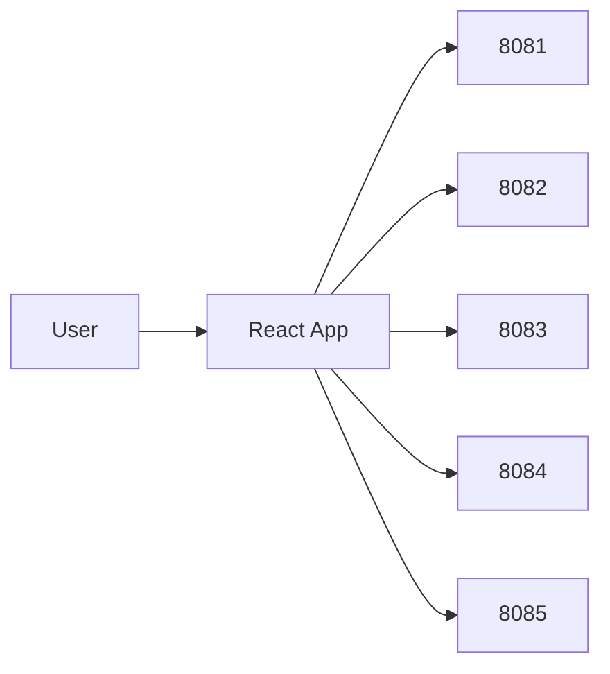

# Tracker App (Frontend)

React SPA for the Daily Life Tracker platform. Talks to all backend microservices via REST.

**Port:** 5173 (dev)

## Architecture



## Features

| Route | Page |
|-------|------|
| `/` | Dashboard |
| `/tasks` | Task management |
| `/health` | Health logs |
| `/exercise` | Exercise plans and logs |
| `/expenses` | Expenses and budgets |
| `/notifications` | Notifications and insights |
| `/profile` | User profile |
| `/admin` | Admin dashboard |

Auth routes: `/login`, `/register`, `/forgot-password`, `/verify-otp`, `/reset-password`

## Stack

React 19, Vite, Redux Toolkit, React Router, Tailwind CSS, Axios

## Environment Variables

Copy `.env.example` to `.env`:

```
VITE_AUTH_SERVICE_URL=http://localhost:8081
VITE_TASK_SERVICE_URL=http://localhost:8082
VITE_HEALTH_SERVICE_URL=http://localhost:8083
VITE_EXPENSE_SERVICE_URL=http://localhost:8084
VITE_NOTIFICATION_SERVICE_URL=http://localhost:8085
```

## Run

```bash
npm install
npm run dev
```

Open `http://localhost:5173`. Backend services must be running first.
